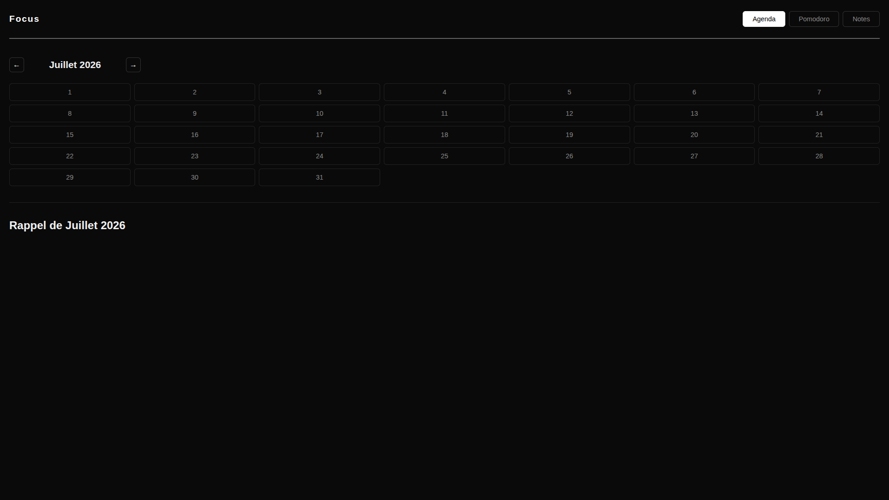
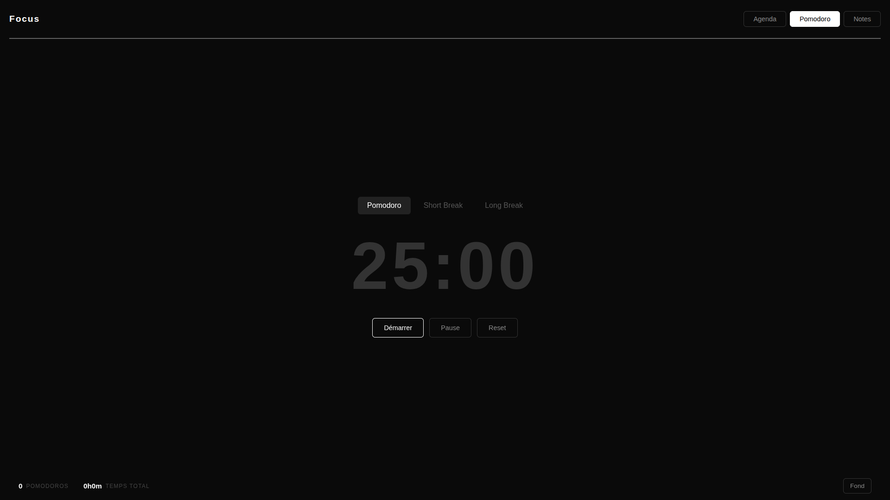
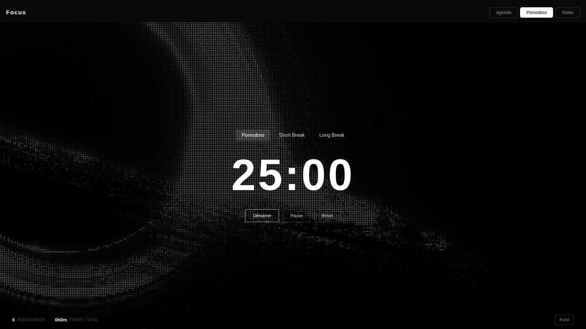
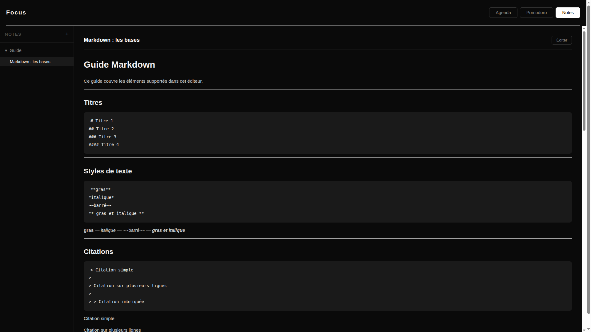

# Focus 🎯

> Application de productivité étudiante — Agenda, Pomodoro et Notes en un seul endroit.

   

---

## Présentation

**Focus** est une application de productivité conçue pour les étudiants. Elle regroupe trois outils essentiels dans une interface sobre et minimaliste (noir & blanc) disponible en version **web** et **desktop** grâce à Electron.

---

## Aperçu

### Agenda


### Pomodoro




### Notes


---

## Fonctionnalités

#### 📅 Agenda
- Calendrier mensuel avec navigation entre les mois
- Ajout de rappels sur chaque jour
- Couleur de bordure personnalisable par rappel (blanc, rouge, jaune, vert)
- Récapitulatif des rappels du mois en bas de page
- Persistance des données via `localStorage`

#### 🍅 Pomodoro
- Timer avec 3 modes : **Pomodoro** (25 min), **Short Break** (5 min), **Long Break** (15 min)
- Boutons Démarrer / Pause / Reset
- Statistiques : nombre de pomodoros complétés et temps total
- Fond d'écran personnalisable parmi des images présélectionnées
- Notification système à la fin de chaque session
- Timer persistant entre les onglets

#### 📝 Notes
- Organisation par dossiers
- Éditeur **Markdown** avec aperçu en temps réel
- Basculement entre mode édition et mode preview
- Guide Markdown intégré au démarrage
- Persistance des données via `localStorage`

---

## Stack technique

| Technologie | Usage |
|-------------|-------|
| React 19 | Interface utilisateur |
| Vite 8 | Bundler et serveur de développement |
| Electron 43 | Application desktop cross-platform |
| react-markdown | Rendu Markdown dans les notes |
| localStorage | Persistance des données |

---

## Installation

### Prérequis

- [Node.js](https://nodejs.org/) v18 ou supérieur
- Git

### Cloner le projet

```bash
git clone https://github.com/Elicopter-Nc/desktop-app.git
cd desktop-app
npm install
```

---

## Lancer l'application

### Version web (tous OS)

```bash
npm run dev
```

Ouvre [http://localhost:5173](http://localhost:5173) dans ton navigateur.

---

### Version desktop — Windows

**En mode développement :**
```bash
npm run electron:dev
```

**Builder le `.exe` :**
```bash
npm run electron:build
```

Le fichier installateur `.exe` est généré dans `release/`.
Tu peux aussi lancer l'app directement sans l'installer :
```bash
.\release\win-unpacked\Focus.exe
```

---

### Version desktop — Linux

**En mode développement :**
```bash
npm run electron:dev
```

> Si tu as une erreur de sandbox, modifie le script `electron:dev` dans `package.json` pour ajouter `--no-sandbox` à la fin de la commande electron.

**Builder le `.AppImage` :**
```bash
npm run electron:build -- --no-sandbox
```

Le fichier `.AppImage` est généré dans `release/`.
Tu peux aussi lancer l'app directement sans l'installer :
```bash
./release/linux-unpacked/focus
```

---

## Build — résumé

| OS | Commande | Fichier généré |
|----|----------|----------------|
| Windows | `npm run electron:build` | `release/*.exe` |
| Linux | `npm run electron:build -- --no-sandbox` | `release/*.AppImage` |
| macOS | `npm run electron:build` | `release/*.dmg` |

---

## Structure du projet

```
focus/
├── .github/
│   └── assets/            ← Screenshots du README
├── public/
│   └── backgrounds/       ← Images de fond du Pomodoro
├── src/
│   ├── App.jsx            ← Composant racine + logique Pomodoro
│   ├── Agenda.jsx         ← Onglet Agenda
│   ├── Agenda.css
│   ├── Pomodoro.jsx       ← Onglet Pomodoro
│   ├── Pomodoro.css
│   ├── Notes.jsx          ← Onglet Notes
│   ├── Notes.css
│   ├── markdownGuide.js   ← Guide Markdown intégré
│   └── index.css          ← Styles globaux
├── electron.cjs           ← Point d'entrée Electron
├── package.json
└── vite.config.js
```

---

## Utilisation

### Agenda
1. Navigue entre les mois avec les flèches `←` `→`
2. Clique sur un jour pour ajouter un rappel
3. Choisis une couleur avec le bouton **Couleur**
4. Clique sur **Sauvegarder** — le rappel apparaît dans le récapitulatif en bas

### Pomodoro
1. Choisis un mode : **Pomodoro**, **Short Break** ou **Long Break**
2. Clique sur **Démarrer**
3. Une notification apparaît à la fin de chaque session
4. Change le fond d'écran avec le bouton **Fond** en bas à droite

### Notes
1. Clique sur `+` dans la sidebar pour créer un dossier
2. Survole un dossier et clique sur `+` pour créer une note
3. Écris en **Markdown** dans l'éditeur
4. Bascule entre **Éditer** et **Preview** en haut à droite

---

## Licence

MIT — libre d'utilisation et de modification.

---

*Projet réalisé dans le cadre d'un apprentissage personnel de React et Electron *
